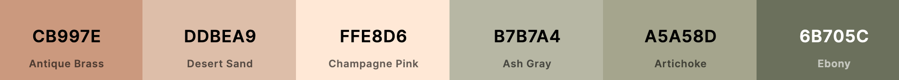

# frontend

## Color pallete:

https://coolors.co/cb997e-ddbea9-ffe8d6-b7b7a4-a5a58d-6b705c



UI
`#cb997e`, 
`#ddbea9`,
`#ffe8d6`,

Navbar
`#b7b7a4`,
`#a5a58d`,
`#6b705c`

## Project setup
```
npm install
```

### Compiles and hot-reloads for development
```
npm run serve
```

### Compiles and minifies for production
```
npm run build
```

### Lints and fixes files
```
npm run lint
```

### Customize configuration
See [Configuration Reference](https://cli.vuejs.org/config/).
